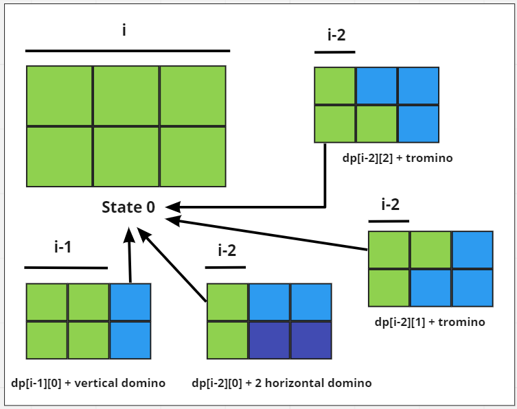

# Dynamic Programming
## Intro:

### Pattern:
1. Optimal Substructure
2. Overlapping SubProblems

### TopDown Approach
`fib(n)=fib(n-1)+fib(n-2)+ ..... + fib(1)+fib(0)`
### Bottom Up Approach
`(f(0)+f(1)=f(2))+f(1)=f(3).......=f(n-1)+ f(n-2)=f(n)`
### Real World problems:
1. Optimal route planning in gps navigation systems
2. Text Justification
3. Robotics motion planning
4. 
## Practice Problems
## Category 1: Knapsack
### 1. 0/1 Knapsack 
````
input: list of weights, list of profits of objects and capacity of bag
output: maximum value that can be put in the bag  
````
#### Steps : [Solution](knapsack_01.py)
#### Brute force
1. Base case: if there is no item to add in the bag or max capacity is reached then return 0
2. if the current item weighs more than capacity , then we don't include the item and move to next item. 
3. else we make two recursive calls , one for including the item in the bag and other for excluding the item in the bag. we take maximum if these two values.
#### Top-Down Memoization:
in the naive solution we get two variable(capacity and the number of items to consider) changes in recursive call. therefore, we take a 2D table to memoize. 
#### Bottom-Up Tabulation: 
1. 2D table dp of size(n+1)*(capacity+1). Each row corresponds to an item and each column represents the remaining capacity of knapsack at any given point.
2. dp[i][j] stores the value of the combination that consists of 0 or more of the first items that doesn't weigh more than j and there is no combination of these items that yields a higher profit.
3. first, we fill the first column with 0 , since the value of knapsack is 0 when the capacity is 0
4. then we fill the first row with 0,since 0 items added will have no value. 
5. for the remaining rows , we iterate from top-left to bottom-right
6. if the weight of i-th item is less than or equal j-weights[i] capacity than we can find the max profit from calculating the including it and excluding it  
7. else we reuse the subproblem of dp[i-1][j]
8. return the last entry dp[n][capacity]
#### Memory Optimized Tabulation: 
1. To fill up a row, we only require the previous row's values. so we can declare 2 arrays of size (Capacity+1)
2. dp: this array represents the sub-problems up to (i-1)th item. we only need these solutions to compute the solution up to i-th item 
3. temp: this array represents the sub-problems up to the current ith item
#### Complexity
`Time:O(capacity*len(weights))
Space:O(capacity)`

### 2. Coin Change
````
input: list of coins and target amount to be made using those coins 
output: minimum number of coins that can be used to make up the amount. if the amount can not be make , return -1
````
#### Brute force
1. traverse the list of coins . to make the amount we can either use the coin or leave the coin.
2. calculate for both case and return the minimum
3. if we take the coin then new amount we have to make is amount-coin_value. we can reuse the coin as well. 
4. if we leave the coin then we move onto the next coin and calculate using the same formula.
#### Top-Down memoization:
cache the result of a recursive call for each (amount,position) pair and reuse whenever necessary
#### Bottom Up tabulation:
1. define a 2D array dp for each coins[i] and amount[j] pair where dp[i][j] represents the minimum amount of coins needed to make up amount j
using coins[0 to ith]
2. traverse the array by calculating minimum value for each row and column

#### Complexity
`Time:O(amount*len(coins))
Space:O(amount)`

### 3. Coin Change 2 @[Leetcode:Medium](https://leetcode.com/problems/coin-change-ii/)
````
input: list of coins and target amount to be made using those coins 
output: maximum number of combinations of coins that adds equal to the amount. if the amount can not be make , return 0
````
#### Brute force:
1. if amount is 0 then a successful combination is already made. so return 1
2. if amount<0 or pos>=len(coins) return 0, cause no combination can be made.
3. traverse the list of coins . if a coins value is less than amount then chose from two options. 
4. for using the coin,  call the recursive function for (amount-coin_value,index of the coin)
5. for leaving the coin , call the recursive function for the same amount but with the index of next coin.
6. add the return value of the recursive call get the final result.
#### Top-Down Memoization
1. some (amount, index of coin) recursive function is being called multiple times. so we can cache them in a 2D array of length(amount+1)*(len(coins)+1) and reuse the values
##### Bottom Up tabulation:
1. we can traverse the dp table for all coins in reverse order for range (1 to amount+1) as target
2. for each coin we use it or leave it
3. to leave it we take the value of the previously computed rows value 
4. to use the coin take the value of (target -coins[i])th value of the previous amount 
#### Space optimized Bottom Up
To calculate the dp table we only need one array to calculate the ans for x amount and another for x-1 amount only. 
`Time:O(amount*len(coins))
Space:O(amount)`

### 3. Perfect squares @ [Leetcode:Medium](https://leetcode.com/problems/perfect-squares)

````
input:  n 
output: the least number of perfect square numbers that sum to n
````
#### Brute Force
generate list of square numbers <= n
execute coin change problem for the list of square numbers and n
### 4. Combination sum @[Leetcode:Medium](https://leetcode.com/problems/combination-sum-iv/)

same problem as Coin change 2

### 4. Domino and Tromino tiling @ [Leetcode:Medium](https://leetcode.com/problems/domino-and-tromino-tiling)

````
input:  n 
output: the number of ways to tile an 2 x n board
````
#### Observation

let's assume dp[i, j] denoting one of the following arrangements in column index i.
1. The current column can be filled with 1, 2 × 1 dominos in state 0, if the previous column had state 0.
2. The current column can be filled with 2, 1 × 2 dominos horizontally in state 0, if the i – 2 column has state 0.
3. The current column can be filled with an ‘L‘ shaped domino in state 1 and state 2, if the previous column had state 0.
4. The current column can be filled with 1 × 2 shaped domino in state 1 if the previous column has state 2 or in state 2 if the previous column has state 1.
5. Therefore, the transition of the state can be defined as the following:
   1. `dp[i][0] = (dp[i – 1][0] + dp[i – 2][0]+ dp[i – 2][1] + dp[i – 2][2]). `
   2. `dp[i][1] = dp[i – 1][0] + dp[i – 1][2]. `
   3. `dp[i][2] = dp[i – 1][0] + dp[i – 1][1].`
#### Solution
1. If the value of N is less than 3, then print N as the total number of ways.
2. Initialize a 2-dimensional array, say dp[][3] that stores all the states of the dp.
3. Consider the Base Case: dp[0][0] = dp[1][0] = dp[1][1] = dp[1][2] = 1.
4. Iterate over the given range [2, N] and using the variable i and perform the following transitions in the dp as:
    1. `dp[i][0] equals (dp[i – 1][0] + dp[i – 2][0]+ dp[i – 2][1] + dp[i – 2][2]).`
    2.` dp[i][1] equals dp[i – 1][0] + dp[i – 1][2].`
    3. `dp[i][2] equals dp[i – 1][0] + dp[i – 1][1].`

5. After completing the above steps, print the total number of ways stored in `dp[N][0]`.

### 5. Unique Binary Search Trees
````
input:  n 
output: the number of ways to make a unique binary trees of n nodes
````
#### Observation
for `n` number of nodes in a binary tree , we can have root node as 1,2,3....n and then we can organize the left and right
sub-tree according to the root. if root is `r` then each left sub-tree will have `r-1` nodes and right sub-tree will have `n-r` nodes. 
for all possible roots r in the range of n 
multiplying the number of unique binary search trees from the left sub-tree and the number of unique binary search trees
from right subtree will result in the number of unique binary search tree if the root is r .
so by adding all the numbers for all possible roots will result in the result.  
`numTree[n]=(numTree[1]*numTree[n-1])+(numTree[2]*numTree[n-2])+....+(numTree[n-1]*numTree[1])
`
#### [Solution](./../../leetcode/DP/unique_binary_search_trees.py)

1. create a cache array numTree[n+1] with value 1 in each cell
2. for node (2 to n) calculate numTree[node]
3. for each possible root (1 to node) calculate the total possible unique BST 
4. return numTree[n]
`Time:O(n^2)
Space:O(n)`