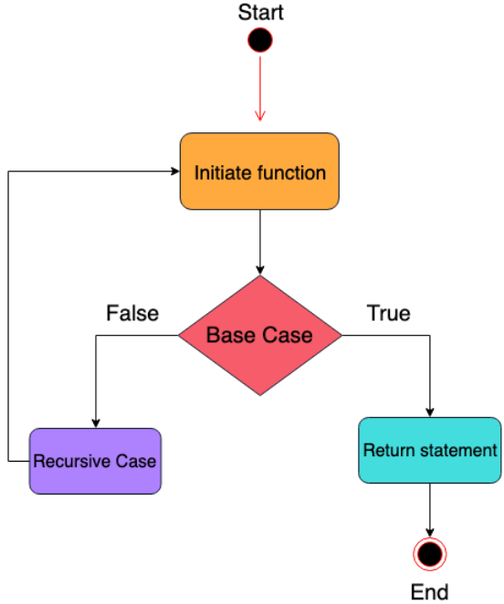

# Recursion
### Definition
Recursion is the process of describing an action in terms of itself.
Recursion occurs when a function calls itself repeatedly until it reaches 
a pre-defined stopping condition.
### Reason to use Recursion 
- Recursive code is generally shorter and easier to write than iterative code.
- Recursion is most useful for tasks that can be defined in terms of similar subtasks.
### Structure
- **Base Case:** where all further calls to the same function stop, meaning that it does not make any subsequent recursive calls.
- **Recursive case:** where the function calls itself repeatedly until it reaches the base case.
  
### Syntax
```
def RecursiveFunction() :
  # Base Case
  if baseCaseCondition :
    return (some base case value)

  # Recursive Case
  else :
    return(recursive call and any other task)
```
### When to use
- when the problem can be broken down into smaller sub-problems.
- when the problem needs arbitrary number of loops. 
#### Notes
- _Recursion is not always the best metod for solving a problem , even if it is possible to do so._
- _if it is confirmed how many loops are needed to solve the problem , it is better to use iterative approach._ 

